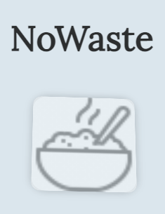
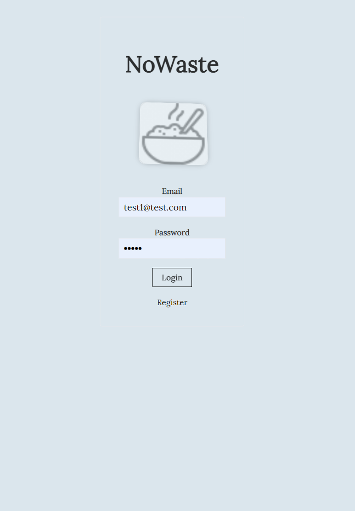
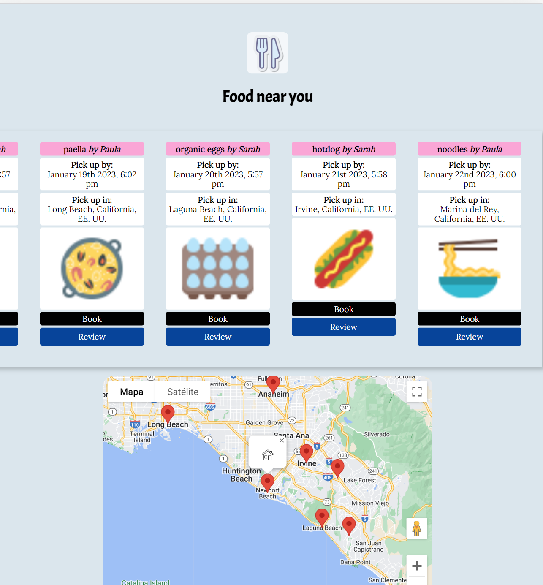

# NoWaste

<p align="center">
  
</p>


NoWaste is an app aimed at helping people share food easily!

1. It allows people to register and upload food items with a brief description and a image to their profile.
2. Other users can access the Find Food dashboard and see a portal with all the food shared in the area with help of Google Maps

## Screenshots

<p align="center">




</p>


## Getting started

1. Clone the repo

```
git clone https://github.com/junagao/woofie.git
cd woofie
```

2. Install dependencies
```
npm install
```

3. Start development server
```
npm start
```

## Author
Jose Alberto Gomez - [Github](https://github.com/Josequesada9393) - [LinkedIn](https://www.linkedin.com/in/jos%C3%A9-alberto-g%C3%B3mez-55aa63117/)
