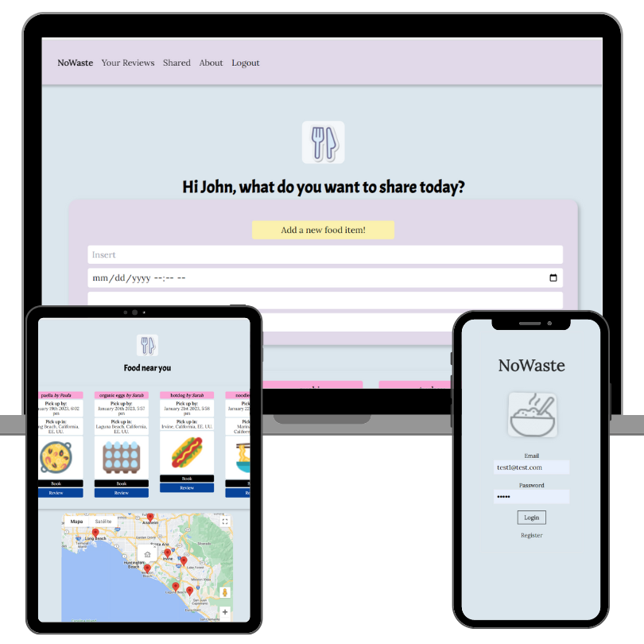

# NoWaste

NoWaste is an app aimed at helping people share food easily! Way too often, people cook too much or they simply buy food that they do not need and ends up going to waste. At NoWaste, we want to be an alternative for people to freely share what they have and reduce food waste while also helping people in their community.


1. It allows people to register and upload food items with a brief description and a image to their profile.
2. Other users can access the Find Food dashboard and see a portal with all the food shared in the area with help of Google Maps.
3. Log into your profile to read the reviews other have shared about you.

## Screenshots

<p align="center">



</p>


## Getting started

1. Clone the repo
```
https://github.com/Josequesada9393/NoWaste.git
cd NoWaste
```

2. Start client at client folder
```
cd client
cd no-waste
npm i
npm start
```
3. Start server at server folder

```
cd server
npm i
npm start
nodemon


```
## Tech Stack
* [React](https://reactjs.org/)
* [NodeJS](https://nodejs.org/en/)
* [Express](https://expressjs.com/)
* [MongoDB](https://www.mongodb.com/)
* [Mongoose](https://mongoosejs.com/docs/)

* [Tachyons UI library](https://tachyons.io/)
* [Google Maps API](https://developers.google.com/maps?hl=en-419)
* [Cloudinary](https://cloudinary.com/users/register_free#gsc.tab=0)


## Author
Jose Alberto Gomez - [Github](https://github.com/Josequesada9393) - [LinkedIn](https://www.linkedin.com/in/jose-alberto-gomez/)
